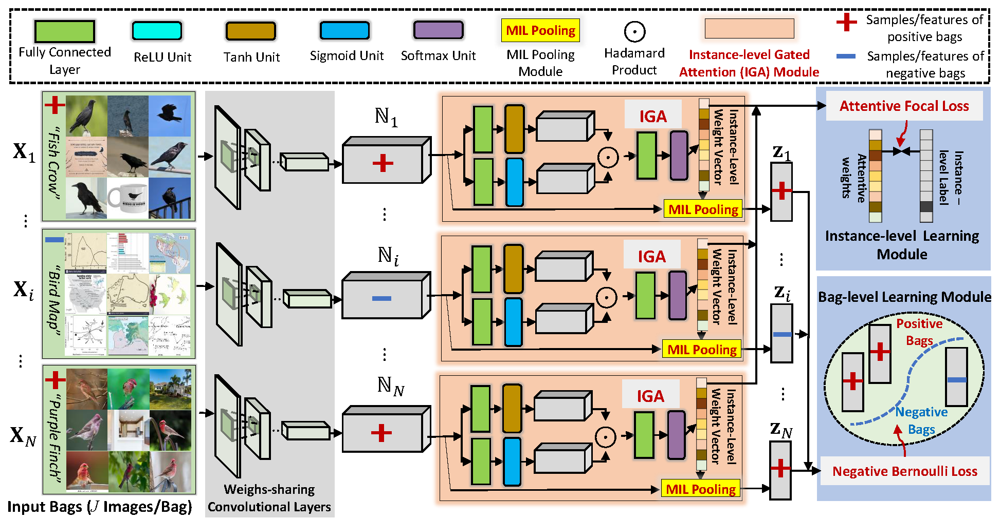

Introduction
------------
This is the source code for our paper **Bridging the Web Data and Fine-Grained Visual Recognition via Alleviating Label Noise and Domain Mismatch**

Network Architecture
--------------------
The architecture of our proposed DDN model is as follows


Installation
------------
After creating a virtual environment of python 3.5, run `pip install -r requirements.txt` to install all dependencies.

How to use
---------------
The code is currently tested only on GPU.
* Data Preparation
    
    Download data into DDN root directory and uncompress them using 
    
    ```
    wget https://fgdata-sh.oss-cn-shanghai.aliyuncs.com/CUB200-Google-100-DDN.tar.gz
    wget https://fgdata-sh.oss-cn-shanghai.aliyuncs.com/CUB200-Google-100-Bilinear.tar.gz
    tar -xvf CUB200-Google-100-DDN.tar.gz
    tar -xvf CUB200-Google-100-Bilinear.tar.gz
    ```

* Demo
    
    If you just want to do a quick test on the model and check the final fine-grained recognition performance, please follow subsequent steps
    - Download one of the following trained models into `demo/model` using
        ```
        wget https://fgdata-sh.oss-cn-shanghai.aliyuncs.com/Model/DDN_Performance_79.80.pth
        ```
        | Model                                   | Description                                                  | Performance(%) |
        | --------------------------------------- | ------------------------------------------------------------ | -------------- |
        | DDN_Performance_79.80.pth               | leverages 100 web images for each category (**DDN**)         | 79.80          |
        

    - Rename the downloaded model to `step2_vgg_16_epoch_best.pth`
    - Create Test data symbolic in `demo` by `ln -s ../CUB200-Google-100-Bilinear data`
    - Activate virtual environment(e.g. conda)
    - Run demo code using `CUDA_VISIBLE_DEVICES=0 python demo.py`

* Source Code

    If you want to train the whole network from beginning using source code, please follow subsequent steps
    (please make sure you have at least 200GB space)
    - Modify `CUDA_VISIBLE_DEVICES` to proper cuda device id in `runall.sh`, 
    - Activate virtual environment(e.g. conda) and then run the script
        ```
        bash runall.sh
        ```


Citation
---
If you find this useful in your research, please consider citing:
```
@inproceedings{yao2020ddn,
title={Bridging the Web Data and Fine-Grained Visual Recognition via Alleviating Label Noise and Domain Mismatch},
author={Yazhou Yao, Xiansheng Hua, Guanyu Gao, Zeren Sun, Zhibin Li, JIan Zhang},
booktitle={ACM International Conference on Multimedia (ACM MM)},
year={2020}
}
```
